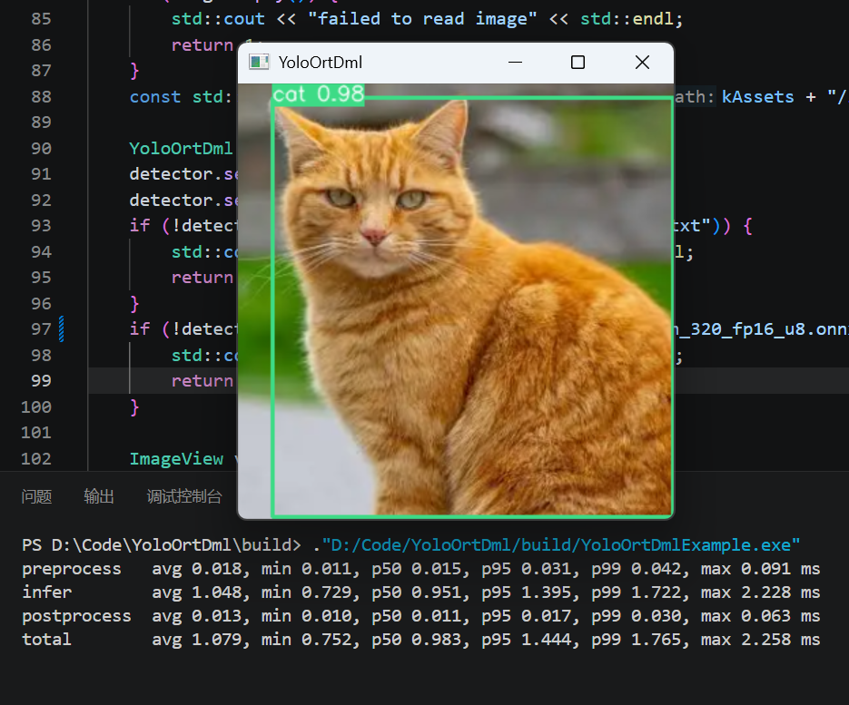

# YoloOrtDml

**High-speed YOLO object detection on Windows — ONNX Runtime + DirectML, zero OpenCV dependency.**

A lean C++ inference library tuned for minimum per-frame latency: a full detect cycle
(preprocess → inference → postprocess) runs in **under 1 ms** with YOLOv6-N @ 320 on a laptop RTX 3060.

English | [中文文档](docs/README-Chinese.md)



*Detection and per-stage timing with `yolov6n_320_fp16_u8.onnx`.*

## Highlights

- **~1100 FPS end-to-end** (YOLOv6-N 320, RTX 3060 Laptop) — see [Performance](#performance)
- **DirectML GPU inference**: runs on any DirectX 12 GPU (NVIDIA / AMD / Intel), no CUDA or vendor SDK required
- **No OpenCV**: the library depends on ONNX Runtime only; preprocessing is hand-written SIMD (SSSE3 deinterleave, F16C fp16 conversion, fused resize + normalize + letterbox in one pass)
- **Allocation-free hot path**: IoBinding pre-binding, preallocated input/output tensors, cached tensor objects — after the first frame, nothing is allocated or re-resolved
- **Baked u8 models** ([tools/onnx_to_yoloortdml.py](tools/onnx_to_yoloortdml.py)): layout conversion, normalization and fp16 output cast are moved *into* the ONNX graph and run on the GPU; CPU preprocessing collapses to a row copy (~0.02 ms) and PCIe traffic drops to a quarter
- **Automatic model adaptation**: input resolution (256 / 320 / 640 / ...), fp32 / fp16 / uint8 input, and the output layout are all detected from model metadata — no code changes when you swap models
- High-priority D3D12 command queue, so inference stays responsive while other applications load the GPU

## Supported models

| Family | Output layout | Notes |
|---|---|---|
| YOLOv5 / v6 / v7 style | row-major `[1, N, 4+1+C]` (objectness) | |
| YOLOv8 / v9 / v11 / v12 style | planar `[1, 4+C, N]` | |
| YOLOv10 / v26 end-to-end | `[1, N, 6]` | NMS inside the model |

- fp32 or fp16 weights; float32, float16 or baked uint8 input tensors
- any static input resolution and 1- or 3-channel input, both read from the model
- output layout and class IDs are inferred from the model output shape; no label file is required

> For YOLOv10 / YOLO26, regenerate models with the current conversion tool. Older conversions
> can leave unused Cast branches after TopK, causing DirectML graph fusion to fail and inference to slow down.

## Performance

Measured with 320×320 BGR input (matching the model size), averages over 100 consecutive frames after warm-up.
Hardware: Intel i7-12700H + NVIDIA GeForce RTX 3060 Laptop GPU, Windows 11, ONNX Runtime 1.28 (DirectML).

| Model | Preprocess | Inference | Postprocess | Total | FPS |
|---|---|---|---|---|---|
| `yolov5n_320_fp16_u8.onnx` | 0.022 ms | 1.34 ms | 0.013 ms | **1.38 ms** | ~725 |
| `yolov6n_320_fp16_u8.onnx` | 0.019 ms | 0.86 ms | 0.013 ms | **0.89 ms** | ~1120 |

When the input image size differs from the model size, the SIMD resize path adds roughly 0.14–0.19 ms.

## Requirements

- Windows 10 / 11 with a DirectX 12 capable GPU
- **ONNX Runtime shared build with the DirectML execution provider** (tested with 1.28) — provides `onnxruntime.dll`, `onnxruntime_providers_shared.dll`, `DirectML.dll`
- MSVC 2022 (C++17), CMake ≥ 3.16
- **OpenCV is NOT required** — the library never touches it; the example below uses OpenCV only to load and display images
- Python 3 with `pip install onnx onnxruntime` — only if you use the optional model tools

## Build & install

1. Open [CMakeLists.txt](CMakeLists.txt) and point `ONNXRUNTIME_PATH` at your own ONNX Runtime DirectML package:

```cmake
set(ONNXRUNTIME_PATH "D:/CodeLibraries/ONNXRuntime-1.28.0-Shared")   # <-- change this
```

The package is expected to contain `include/onnxruntime`, `lib/onnxruntime.lib`, `lib/cmake/onnxruntime` and `bin/*.dll`.

2. Configure, build and install:

```bash
cmake -S . -B build -DCMAKE_BUILD_TYPE=Release
cmake --build build --config Release
cmake --install build --prefix D:/libs/YoloOrtDml
```

The install tree ships everything a consumer needs: `YoloOrtDml.dll` + import library, the single public header `YoloOrtDml.h`, the ONNX Runtime / DirectML runtime DLLs, and a CMake package config.

## Using the library in your project

```cmake
list(APPEND CMAKE_PREFIX_PATH "D:/libs/YoloOrtDml")    # your install prefix
find_package(YoloOrtDml CONFIG REQUIRED)

add_executable(my_app main.cpp)
target_link_libraries(my_app PRIVATE YoloOrtDml::YoloOrtDml)

# copy every runtime DLL next to your executable
add_custom_command(TARGET my_app POST_BUILD
    COMMAND ${CMAKE_COMMAND} -E copy_if_different
        ${YoloOrtDml_RUNTIME_DLLS}
        "$<TARGET_FILE_DIR:my_app>"
    VERBATIM
)
```

`YoloOrtDml_RUNTIME_DLLS` is provided by the package config and lists `YoloOrtDml.dll`, `onnxruntime.dll`, `onnxruntime_providers_shared.dll` and `DirectML.dll`.

## Model tools

[tools/onnx_to_yoloortdml.py](tools/onnx_to_yoloortdml.py) converts a model to fp16 and bakes
preprocessing in one step (`pip install onnx onnxruntime` first).

```bash
python tools/onnx_to_yoloortdml.py model.onnx          # -> model_fp16_u8.onnx
```

The tool converts float32 weights and computation to float16, then rewrites the input to
`uint8[1,H,W,C]` (NHWC, RGB for 3-channel models) with `Transpose → Cast → Mul(1/255)` preprocessing.
It supports static spatial dimensions and 1 or 3 channels. Already-fp16 weights are detected and
skipped; resizing remains on the CPU. The engine detects uint8 inputs automatically.

Operators in the ONNX Runtime converter's block list, including TopK and NMS, retain fp32.
After conversion, nodes that do not contribute to any graph output are removed. In particular,
YOLOv10 / YOLO26 may use only TopK's indices: the converter adds a Cast to the unused values
output, and that dead branch can make DirectML graph compilation fail. Removing it preserves
model outputs and allows graph fusion to remain enabled.

## API

The public surface is a single header, [YoloOrtDml.h](YoloOrtDml/include/YoloOrtDml.h) — no ONNX Runtime types leak through it.
All public types live in the `YOD` namespace.

| Method | Description |
|---|---|
| `bool setModel(std::string modelPath)` | Load an ONNX model and create the DirectML session (CPU fallback). Input size / type / layout are auto-detected. |
| `void setDevice(int device)` | GPU adapter index (DXGI enumeration order), default 0. Reloads the session if a model is already set. |
| `void setConfidenceThreshold(float)` | Score threshold for keeping detections. |
| `void setNMSThreshold(float)` | IoU threshold for non-maximum suppression. |
| `void setImage(ImageView&)` | Store a **non-owning** view of the image. Pixel data must stay valid until `preprocess()` returns. |
| `void preprocess()` | Image → input tensor (SIMD resize / convert, or row copy for baked models). |
| `void infer()` | One `Run` on the GPU via pre-bound IoBinding. |
| `void postprocess()` | Decode + NMS. |
| `std::vector<DetectResultBox> resultBoxes()` | Boxes in original-image pixel coordinates: `x, y, width, height, score, classId`. |

The three pipeline stages are split on purpose so you can time each one.
`ImageView` accepts `BGR8`, `RGB8`, `BGRA8`, `RGBA8` and `GRAY8` data with an arbitrary row stride.

## API example

OpenCV appears here **only** to load and display the image — the library itself has no OpenCV dependency.

```cpp
#include <iostream>
#include <opencv2/opencv.hpp>

#include "YoloOrtDml.h"

int main()
{
    // -------------------- configuration --------------------
    YOD::YoloOrtDml detector;
    detector.setDevice(0);                    // GPU adapter index
    detector.setConfidenceThreshold(0.3f);
    detector.setNMSThreshold(0.45f);
    if (!detector.setModel("yolov6n_320_fp16_u8.onnx")) {
        std::cerr << "failed to load model" << std::endl;
        return 1;
    }

    // -------------------- wrap a cv::Mat (no pixel copy) --------------------
    cv::Mat image = cv::imread("test.jpg");   // 8-bit BGR
    YOD::ImageView view;
    view.data = image.data;                   // pixel pointer
    view.width = image.cols;
    view.height = image.rows;
    view.channels = image.channels();
    view.stride = image.step;                 // bytes per row (handles padded strides)
    view.format = YOD::ImageFormat::BGR8;     // BGR8 / RGB8 / BGRA8 / RGBA8 / GRAY8

    // -------------------- inference --------------------
    detector.setImage(view);                  // pixels must stay valid until preprocess() returns
    detector.preprocess();
    detector.infer();
    detector.postprocess();

    // -------------------- results --------------------
    for (const YOD::DetectResultBox& box : detector.resultBoxes()) {
        std::cout << "class " << box.classId << " score " << box.score
                  << " box [" << box.x << ", " << box.y << ", "
                  << box.width << ", " << box.height << "]" << std::endl;
        cv::rectangle(image,
                      cv::Rect(cvRound(box.x), cvRound(box.y),
                               cvRound(box.width), cvRound(box.height)),
                      cv::Scalar(0, 255, 0), 2);
    }
    cv::imshow("YoloOrtDml", image);
    cv::waitKey(0);
    return 0;
}
```

Deployment: place `YoloOrtDml.dll`, `onnxruntime.dll`, `onnxruntime_providers_shared.dll` and
`DirectML.dll` next to your executable (the CMake snippet above does this automatically).
